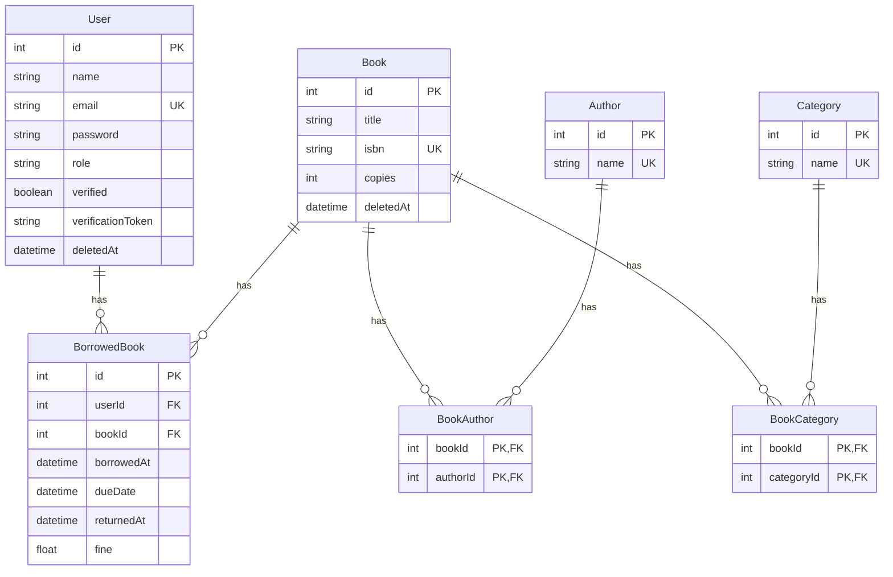

# Library Management System

## Overview

The Library Management System is a web application designed to manage the borrowing and returning of books in a library. It provides functionalities for users to view their details, track borrowed books, pay fines, and manage book inventory. The system is built using TypeScript, Express, and Prisma, and it utilizes a PostgreSQL database for data storage.

## Features

- **User Management**: Users can view their details and manage their accounts.
- **Book Borrowing**: Users can borrow books, with a limit on the number of books that can be borrowed at a time.
- **Book Returning**: Users can return borrowed books and calculate any fines incurred.
- **Fine Management**: Users can view and pay fines associated with their borrowed books.
- **Admin Features**: Admins can add, edit, and delete books from the inventory.
- **Analytics**: The system provides analytics on the most borrowed books and monthly usage reports.
- **Email Notifications**: Users receive email notifications when a borrowed book is nearing its return date, helping them to avoid late returns and associated fines.
- **Caching with Redis**: The application uses Redis for caching book details to improve performance. When a book is requested, the system first checks the cache before querying the database.

## Database Design

The database design for the Library Management System is structured to efficiently manage users, books, borrowing records, and fines. The key entities in the database include:

- **User**: Stores user information such as ID, name, email, password, role, and verification status.
- **Book**: Contains details about each book, including ID, title, ISBN, number of copies, and deletion status.
- **BorrowedBook**: Represents the relationship between users and books, tracking which books are borrowed, the borrowing date, due date, return date, and any fines incurred.
- **Author**: Contains information about book authors.
- **Category**: Classifies books into different categories.

The relationships between these entities are defined as follows:

- A **User** can borrow multiple **Books**.
- A **Book** can be associated with multiple **Authors** and **Categories**.
- The **BorrowedBook** entity serves as a junction table to link **Users** and **Books**, capturing the borrowing details.



## Technologies Used

- TypeScript
- Express.js
- Prisma (ORM)
- PostgreSQL
- JWT for authentication
- Zod for input validation
- Redis for caching
- Nodemailer for sending emails

## Setup Instructions

To set up the project locally, follow these steps:

1. **Clone the Repository**:
   ```bash
   git clone github.com/gurshaan17/library-management
   cd library-management
   ```

2. **Install Dependencies**:
   Make sure you have Node.js and npm installed. Then run:
   ```bash
   npm install
   ```

3. **Set Up Environment Variables**:
   Create a `.env` file in the root directory and add the following variables:
   ```
    DATABASE_URL = ""
    JWT_SECRET = ""
    SMTP_HOST = ""
    SMTP_PORT = ""
    SMTP_USER = ""
    SMTP_PASS = ""
    SMTP_FROM = ""
   ```

4. **Run Prisma Migrations**:
   Ensure your database is set up and run the following command to create the necessary tables:
   ```bash
   npx prisma migrate dev --name init
   ```

5. **Start Redis**:
   Make sure you have Redis installed and running. Start Redis with the following command:
   ```bash
   redis-server
   ```
   You can monitor the Redis cache by running:
   ```bash
   redis-cli monitor
   ```

6. **Build the Project**:
   Compile the TypeScript code to JavaScript:
   ```bash
   npx tsc -b
   ```

7. **Run the Application**:
   You can run the application using either of the following commands:
   ```bash
   node dist/index.js
   ```
   or
   ```bash
   bun dist/index.js
   ```

## API Endpoints

- **User Routes**:
  - `GET /users/:id`: Get user details.
    - **Description**: Retrieves details of a user by their ID.
    - **Parameters**: 
      - `id`: User ID (in the URL).
    - **Example Request**: 
      ```
      GET /users/1
      ```
  
  - `GET /users/:id/borrowed-books`: Get borrowed books for a user.
    - **Description**: Retrieves a list of books borrowed by a user.
    - **Parameters**: 
      - `id`: User ID (in the URL).
    - **Example Request**: 
      ```
      GET /users/1/borrowed-books
      ```

  - `PATCH /users/:id/enable-disable`: Enable or disable a user account.
    - **Description**: Enables or disables a user account.
    - **Parameters**: 
      - `id`: User ID (in the URL).
    - **Request Body**:
      ```json
      {
        "enabled": true // or false
      }
      ```
    - **Example Request**: 
      ```
      PATCH /users/1/enable-disable
      ```

- **Borrow Routes**:
  - `POST /borrow`: Borrow a book.
    - **Description**: Allows a user to borrow a book.
    - **Request Body**:
      ```json
      {
        "bookId": 1 // ID of the book to borrow
      }
      ```
    - **Example Request**: 
      ```
      POST /borrow
      ```

  - `POST /borrow/return`: Return a borrowed book.
    - **Description**: Allows a user to return a borrowed book.
    - **Request Body**:
      ```json
      {
        "bookId": 1 // ID of the book to return
      }
      ```
    - **Example Request**: 
      ```
      POST /borrow/return
      ```

  - `GET /borrow/limit`: Check borrowing limit.
    - **Description**: Retrieves the current borrowing limit and count for the user.
    - **Example Request**: 
      ```
      GET /borrow/limit
      ```

- **Fine Routes**:
  - `GET /fine/calculate/:borrowedBookId`: Calculate fine for a borrowed book.
    - **Description**: Calculates the fine for a specific borrowed book.
    - **Parameters**: 
      - `borrowedBookId`: ID of the borrowed book (in the URL).
    - **Example Request**: 
      ```
      GET /fine/calculate/1
      ```

  - `GET /fine/total`: Get total fines for a user.
    - **Description**: Retrieves the total fines for the authenticated user.
    - **Example Request**: 
      ```
      GET /fine/total
      ```

- **Book Routes**:
  - `GET /books/:isbnOrTitle`: Get book details by ISBN or title.
    - **Description**: Retrieves details of a book by its ISBN or title.
    - **Parameters**: 
      - `isbnOrTitle`: ISBN or title of the book (in the URL).
    - **Example Request**: 
      ```
      GET /books/1234567890
      ```

  - `GET /books`: Search for books.
    - **Description**: Searches for books based on query parameters.
    - **Example Request**: 
      ```
      GET /books?title=Harry Potter
      ```

  - `POST /books`: Add a new book (admin only).
    - **Description**: Adds a new book to the inventory.
    - **Request Body**:
      ```json
      {
        "title": "New Book Title",
        "isbn": "1234567890",
        "copies": 5,
        "authors": ["Author Name"],
        "categories": ["Category Name"]
      }
      ```
    - **Example Request**: 
      ```
      POST /books
      ```

  - `PUT /books/:id`: Edit a book (admin only).
    - **Description**: Edits the details of an existing book.
    - **Parameters**: 
      - `id`: ID of the book (in the URL).
    - **Request Body**:
      ```json
      {
        "title": "Updated Book Title",
        "copies": 10
      }
      ```
    - **Example Request**: 
      ```
      PUT /books/1
      ```

  - `DELETE /books/:id`: Delete a book (admin only).
    - **Description**: Deletes a book from the inventory.
    - **Parameters**: 
      - `id`: ID of the book (in the URL).
    - **Example Request**: 
      ```
      DELETE /books/1
      ```

- **Analytics Routes**:
  - `GET /analytics/most-borrowed`: Get the most borrowed books (admin only).
    - **Description**: Retrieves a list of the most borrowed books.
    - **Example Request**: 
      ```
      GET /analytics/most-borrowed
      ```

  - `GET /analytics/monthly-report`: Generate a monthly usage report (admin only).
    - **Description**: Generates a report of book usage for a specific month.
    - **Example Request**: 
      ```
      GET /analytics/monthly-report?month=1&year=2023
      ```

## Conclusion

This Library Management System provides a comprehensive solution for managing library operations, ensuring a smooth experience for both users and administrators. With its robust features and easy setup, it serves as an excellent tool for any library.
