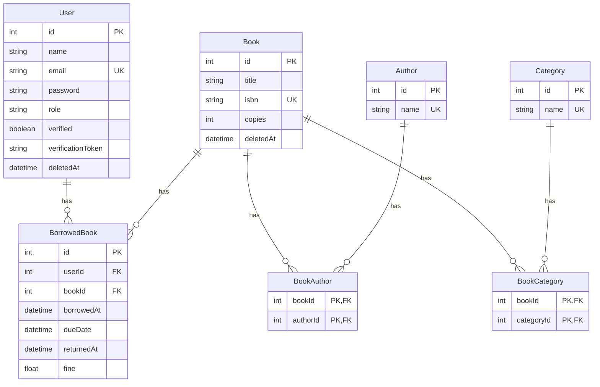

# Library Management System

## Overview

The Library Management System is a web application designed to manage the borrowing and returning of books in a library. It provides functionalities for users to view their details, track borrowed books, pay fines, and manage book inventory. The system is built using TypeScript, Express, and Prisma, and it utilizes a PostgreSQL database for data storage.

## Features

- **User Management**: Users can view their details and manage their accounts.
- **Book Borrowing**: Users can borrow books, with a limit on the number of books that can be borrowed at a time.
- **Book Returning**: Users can return borrowed books and calculate any fines incurred.
- **Fine Management**: Users can view and pay fines associated with their borrowed books.
- **Admin Features**: Admins can add, edit, and delete books from the inventory.
- **Analytics**: The system provides analytics on the most borrowed books and monthly usage reports.
- **Email Notifications**: Users receive email notifications when a borrowed book is nearing its return date, helping them to avoid late returns and associated fines.

## Database Design

The database design for the Library Management System is structured to efficiently manage users, books, borrowing records, and fines. The key entities in the database include:

- **User**: Stores user information such as ID, name, email, password, role, and verification status.
- **Book**: Contains details about each book, including ID, title, ISBN, number of copies, and deletion status.
- **BorrowedBook**: Represents the relationship between users and books, tracking which books are borrowed, the borrowing date, due date, return date, and any fines incurred.
- **Author**: Contains information about book authors.
- **Category**: Classifies books into different categories.

The relationships between these entities are defined as follows:

- A **User** can borrow multiple **Books**.
- A **Book** can be associated with multiple **Authors** and **Categories**.
- The **BorrowedBook** entity serves as a junction table to link **Users** and **Books**, capturing the borrowing details.



## Technologies Used

- TypeScript
- Express.js
- Prisma (ORM)
- PostgreSQL
- JWT for authentication
- Zod for input validation
- Nodemailer (or similar) for sending emails

## Setup Instructions

To set up the project locally, follow these steps:

1. **Clone the Repository**:
   ```bash
   git clone github.com/gurshaan17/library-management-system
   cd library-management-system
   ```

2. **Install Dependencies**:
   Make sure you have Node.js and npm installed. Then run:
   ```bash
   npm install
   ```

3. **Set Up Environment Variables**:
   Create a `.env` file in the root directory and add the following variables:
   ```
    DATABASE_URL = ""
    JWT_SECRET = ""
    SMTP_HOST = ""
    SMTP_PORT = ""
    SMTP_USER = ""
    SMTP_PASS = ""
    SMTP_FROM = ""
   ```

4. **Run Prisma Migrations**:
   Ensure your database is set up and run the following command to create the necessary tables:
   ```bash
   npx prisma migrate dev --name init
   ```

5. **Build the Project**:
   Compile the TypeScript code to JavaScript:
   ```bash
   npx tsc -b
   ```

6. **Run the Application**:
   You can run the application using either of the following commands:
   ```bash
   node dist/index.js
   ```
   or
   ```bash
   bun dist/index.js
   ```

## API Endpoints

- **User Routes**:
  - `GET /users/:id`: Get user details.
  - `GET /users/:id/borrowed-books`: Get borrowed books for a user.
  - `PATCH /users/:id/enable-disable`: Enable or disable a user account.

- **Borrow Routes**:
  - `POST /borrow`: Borrow a book.
  - `POST /borrow/return`: Return a borrowed book.
  - `GET /borrow/limit`: Check borrowing limit.

- **Fine Routes**:
  - `GET /fine/calculate/:borrowedBookId`: Calculate fine for a borrowed book.
  - `GET /fine/total`: Get total fines for a user.

- **Book Routes**:
  - `GET /books/:isbnOrTitle`: Get book details by ISBN or title.
  - `GET /books`: Search for books.
  - `POST /books`: Add a new book (admin only).
  - `PUT /books/:id`: Edit a book (admin only).
  - `DELETE /books/:id`: Delete a book (admin only).

## Conclusion

This Library Management System provides a comprehensive solution for managing library operations, ensuring a smooth experience for both users and administrators. With its robust features and easy setup, it serves as an excellent tool for any library.
